# DAML Token Exchange System - User Flow Chart

## Overview

This document provides a comprehensive user flow chart for the DAML Token Exchange System, integrating the wireframe interface, swap functionality, and underlying business logic. The flow chart covers all user roles, system interactions, and decision points.

## System Architecture Overview

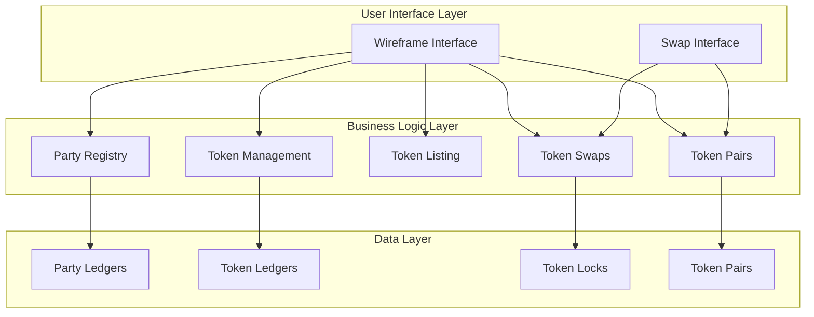
```mermaid
graph TB
    subgraph "User Interface Layer"
        UI[Wireframe Interface]
        SWAP[Swap Interface]
    end
    
    subgraph "Business Logic Layer"
        PR[Party Registry]
        TM[Token Management]
        TL[Token Listing]
        TP[Token Pairs]
        TS[Token Swaps]
    end
    
    subgraph "Data Layer"
        PL[Party Ledgers]
        TLG[Token Ledgers]
        TLL[Token Locks]
        TPS[Token Pairs]
    end
    
    UI --> PR
    UI --> TM
    UI --> TL
    UI --> TP
    UI --> TS
    
    SWAP --> TS
    SWAP --> TP
    
    PR --> PL
    TM --> TLG
    TS --> TLL
    TP --> TPS
```

## 1. System Administrator Workflow

### 1.1 System Initialization Flow

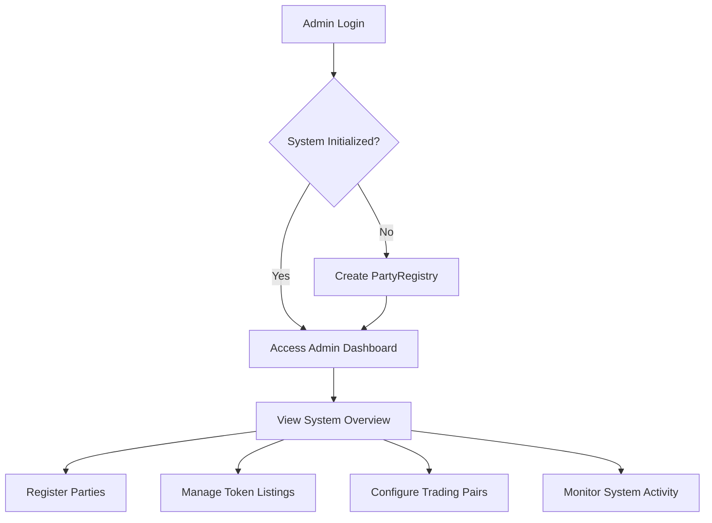
```mermaid
flowchart TD
    A[Admin Login] --> B{System Initialized?}
    B -->|No| C[Create PartyRegistry]
    B -->|Yes| D[Access Admin Dashboard]
    C --> D
    D --> E[View System Overview]
    E --> F[Register Parties]
    E --> G[Manage Token Listings]
    E --> H[Configure Trading Pairs]
    E --> I[Monitor System Activity]
```

### 1.2 Party Registration Flow

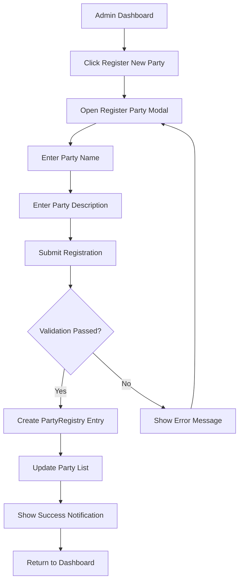
```mermaid
flowchart TD
    A[Admin Dashboard] --> B[Click Register New Party]
    B --> C[Open Register Party Modal]
    C --> D[Enter Party Name]
    D --> E[Enter Party Description]
    E --> F[Submit Registration]
    F --> G{Validation Passed?}
    G -->|Yes| H[Create PartyRegistry Entry]
    G -->|No| I[Show Error Message]
    I --> C
    H --> J[Update Party List]
    J --> K[Show Success Notification]
    K --> L[Return to Dashboard]
```

### 1.3 Token Listing Management Flow

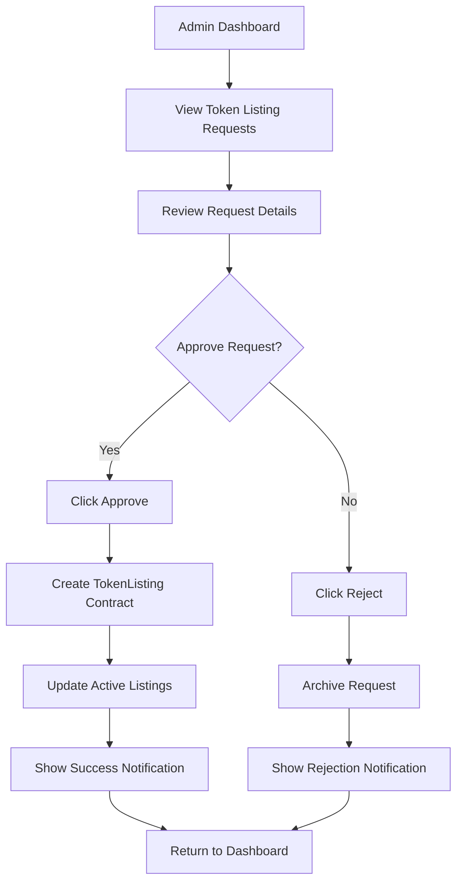
```mermaid
flowchart TD
    A[Admin Dashboard] --> B[View Token Listing Requests]
    B --> C[Review Request Details]
    C --> D{Approve Request?}
    D -->|Yes| E[Click Approve]
    D -->|No| F[Click Reject]
    E --> G[Create TokenListing Contract]
    G --> H[Update Active Listings]
    H --> I[Show Success Notification]
    F --> J[Archive Request]
    J --> K[Show Rejection Notification]
    I --> L[Return to Dashboard]
    K --> L
```

### 1.4 Trading Pair Management Flow

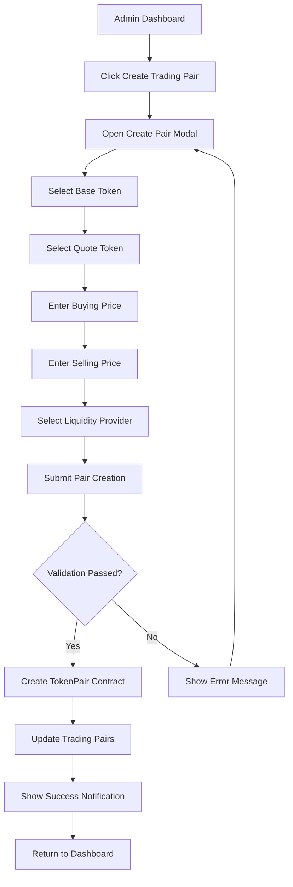
```mermaid
flowchart TD
    A[Admin Dashboard] --> B[Click Create Trading Pair]
    B --> C[Open Create Pair Modal]
    C --> D[Select Base Token]
    D --> E[Select Quote Token]
    E --> F[Enter Buying Price]
    F --> G[Enter Selling Price]
    G --> H[Select Liquidity Provider]
    H --> I[Submit Pair Creation]
    I --> J{Validation Passed?}
    J -->|Yes| K[Create TokenPair Contract]
    J -->|No| L[Show Error Message]
    L --> C
    K --> M[Update Trading Pairs]
    M --> N[Show Success Notification]
    N --> O[Return to Dashboard]
```

## 2. Token Owner Workflow

### 2.1 Token Creation Flow

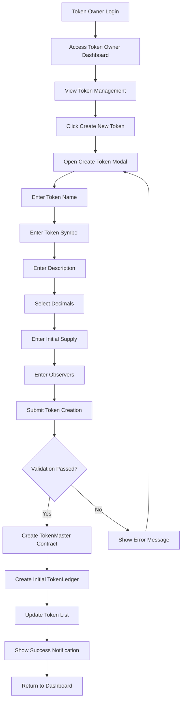
```mermaid
flowchart TD
    A[Token Owner Login] --> B[Access Token Owner Dashboard]
    B --> C[View Token Management]
    C --> D[Click Create New Token]
    D --> E[Open Create Token Modal]
    E --> F[Enter Token Name]
    F --> G[Enter Token Symbol]
    G --> H[Enter Description]
    H --> I[Select Decimals]
    I --> J[Enter Initial Supply]
    J --> K[Enter Observers]
    K --> L[Submit Token Creation]
    L --> M{Validation Passed?}
    M -->|Yes| N[Create TokenMaster Contract]
    M -->|No| O[Show Error Message]
    O --> E
    N --> P[Create Initial TokenLedger]
    P --> Q[Update Token List]
    Q --> R[Show Success Notification]
    R --> S[Return to Dashboard]
```

### 2.2 Token Supply Management Flow

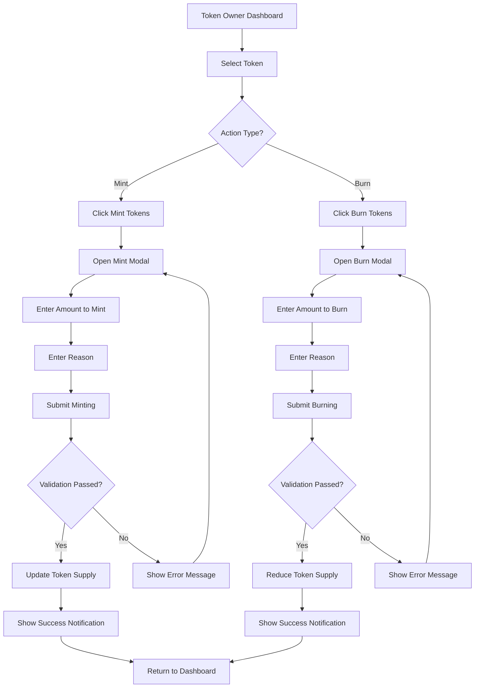
```mermaid
flowchart TD
    A[Token Owner Dashboard] --> B[Select Token]
    B --> C{Action Type?}
    C -->|Mint| D[Click Mint Tokens]
    C -->|Burn| E[Click Burn Tokens]
    D --> F[Open Mint Modal]
    E --> G[Open Burn Modal]
    F --> H[Enter Amount to Mint]
    G --> I[Enter Amount to Burn]
    H --> J[Enter Reason]
    I --> K[Enter Reason]
    J --> L[Submit Minting]
    K --> M[Submit Burning]
    L --> N{Validation Passed?}
    M --> O{Validation Passed?}
    N -->|Yes| P[Update Token Supply]
    O -->|Yes| Q[Reduce Token Supply]
    N -->|No| R[Show Error Message]
    O -->|No| S[Show Error Message]
    R --> F
    S --> G
    P --> T[Show Success Notification]
    Q --> U[Show Success Notification]
    T --> V[Return to Dashboard]
    U --> V
```

### 2.3 Token Listing Request Flow

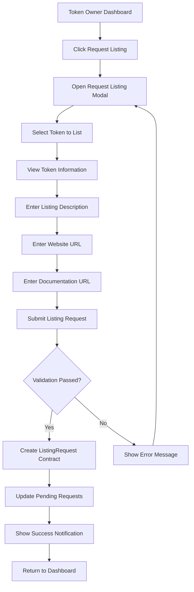
```mermaid
flowchart TD
    A[Token Owner Dashboard] --> B[Click Request Listing]
    B --> C[Open Request Listing Modal]
    C --> D[Select Token to List]
    D --> E[View Token Information]
    E --> F[Enter Listing Description]
    F --> G[Enter Website URL]
    G --> H[Enter Documentation URL]
    H --> I[Submit Listing Request]
    I --> J{Validation Passed?}
    J -->|Yes| K[Create ListingRequest Contract]
    J -->|No| L[Show Error Message]
    L --> C
    K --> M[Update Pending Requests]
    M --> N[Show Success Notification]
    N --> O[Return to Dashboard]
```

## 3. Token Holder Workflow

### 3.1 Token Transfer Flow

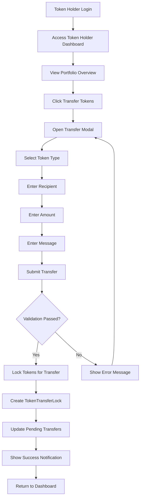
```mermaid
flowchart TD
    A[Token Holder Login] --> B[Access Token Holder Dashboard]
    B --> C[View Portfolio Overview]
    C --> D[Click Transfer Tokens]
    D --> E[Open Transfer Modal]
    E --> F[Select Token Type]
    F --> G[Enter Recipient]
    G --> H[Enter Amount]
    H --> I[Enter Message]
    I --> J[Submit Transfer]
    J --> K{Validation Passed?}
    K -->|Yes| L[Lock Tokens for Transfer]
    K -->|No| M[Show Error Message]
    M --> E
    L --> N[Create TokenTransferLock]
    N --> O[Update Pending Transfers]
    O --> P[Show Success Notification]
    P --> Q[Return to Dashboard]
```

### 3.2 Transfer Response Flow

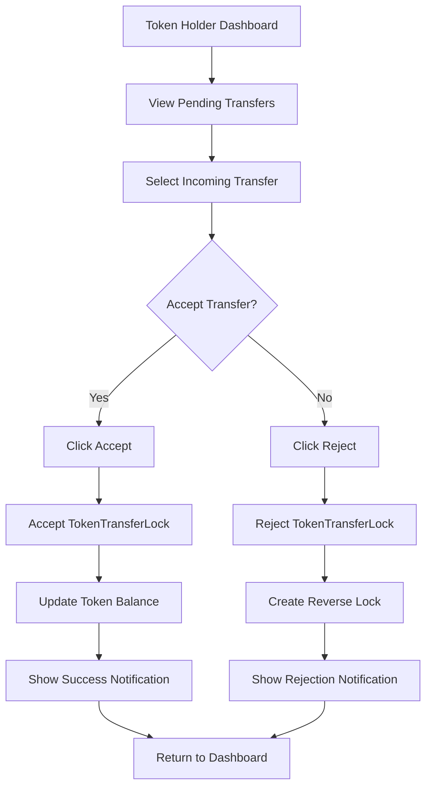
```mermaid
flowchart TD
    A[Token Holder Dashboard] --> B[View Pending Transfers]
    B --> C[Select Incoming Transfer]
    C --> D{Accept Transfer?}
    D -->|Yes| E[Click Accept]
    D -->|No| F[Click Reject]
    E --> G[Accept TokenTransferLock]
    F --> H[Reject TokenTransferLock]
    G --> I[Update Token Balance]
    H --> J[Create Reverse Lock]
    I --> K[Show Success Notification]
    J --> L[Show Rejection Notification]
    K --> M[Return to Dashboard]
    L --> M
```

### 3.3 Swap Initiation Flow

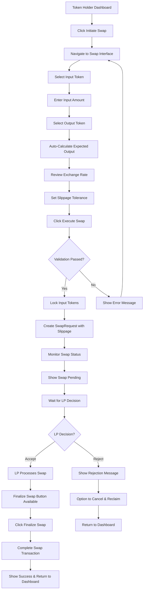
```mermaid
flowchart TD
    A[Token Holder Dashboard] --> B[Click Initiate Swap]
    B --> C[Navigate to Swap Interface]
    C --> D[Select Input Token]
    D --> E[Enter Input Amount]
    E --> F[Select Output Token]
    F --> G[Auto-Calculate Expected Output]
    G --> H[Review Exchange Rate]
    H --> I[Set Slippage Tolerance]
    I --> J[Click Execute Swap]
    J --> K{Validation Passed?}
    K -->|Yes| L[Lock Input Tokens]
    K -->|No| M[Show Error Message]
    M --> C
    L --> N[Create SwapRequest with Slippage]
    N --> O[Monitor Swap Status]
    O --> P[Show Swap Pending]
    P --> Q[Wait for LP Decision]
    Q --> R{LP Decision?}
    R -->|Accept| S[LP Processes Swap]
    R -->|Reject| T[Show Rejection Message]
    S --> U[Finalize Swap Button Available]
    T --> V[Option to Cancel & Reclaim]
    U --> W[Click Finalize Swap]
    W --> X[Complete Swap Transaction]
    X --> Y[Show Success & Return to Dashboard]
    V --> Z[Return to Dashboard]
```

## 4. Liquidity Provider Workflow

### 4.1 Swap Response Flow

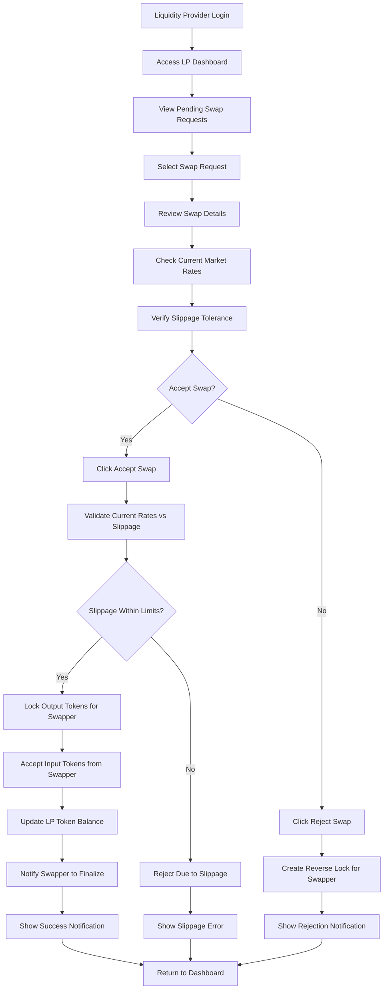
```mermaid
flowchart TD
    A[Liquidity Provider Login] --> B[Access LP Dashboard]
    B --> C[View Pending Swap Requests]
    C --> D[Select Swap Request]
    D --> E[Review Swap Details]
    E --> F[Check Current Market Rates]
    F --> G[Verify Slippage Tolerance]
    G --> H{Accept Swap?}
    H -->|Yes| I[Click Accept Swap]
    H -->|No| J[Click Reject Swap]
    I --> K[Validate Current Rates vs Slippage]
    J --> L[Create Reverse Lock for Swapper]
    K --> M{Slippage Within Limits?}
    M -->|Yes| N[Lock Output Tokens for Swapper]
    M -->|No| O[Reject Due to Slippage]
    N --> P[Accept Input Tokens from Swapper]
    O --> Q[Show Slippage Error]
    P --> R[Update LP Token Balance]
    L --> S[Show Rejection Notification]
    R --> T[Notify Swapper to Finalize]
    Q --> U[Return to Dashboard]
    S --> U
    T --> V[Show Success Notification]
    V --> U
```

### 4.2 Swap History Management Flow

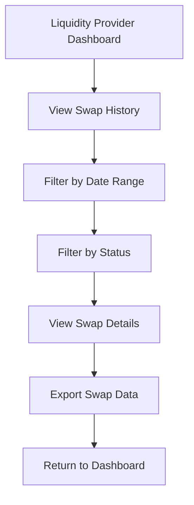
```mermaid
flowchart TD
    A[Liquidity Provider Dashboard] --> B[View Swap History]
    B --> C[Filter by Date Range]
    C --> D[Filter by Status]
    D --> E[View Swap Details]
    E --> F[Export Swap Data]
    F --> G[Return to Dashboard]
```

## 5. Swap Execution Flow

### 5.1 Complete Swap Process

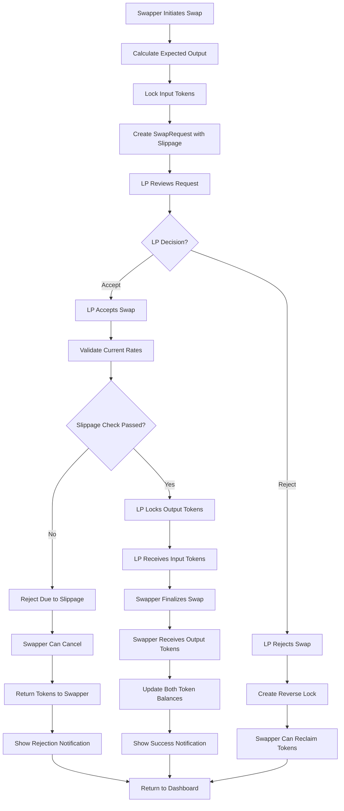
```mermaid
flowchart TD
    A[Swapper Initiates Swap] --> B[Calculate Expected Output]
    B --> C[Lock Input Tokens]
    C --> D[Create SwapRequest with Slippage]
    D --> E[LP Reviews Request]
    E --> F{LP Decision?}
    F -->|Accept| G[LP Accepts Swap]
    F -->|Reject| H[LP Rejects Swap]
    G --> I[Validate Current Rates]
    H --> J[Create Reverse Lock]
    I --> K{Slippage Check Passed?}
    K -->|Yes| L[LP Locks Output Tokens]
    K -->|No| M[Reject Due to Slippage]
    L --> N[LP Receives Input Tokens]
    M --> O[Swapper Can Cancel]
    N --> P[Swapper Finalizes Swap]
    O --> Q[Return Tokens to Swapper]
    P --> R[Swapper Receives Output Tokens]
    Q --> S[Show Rejection Notification]
    R --> T[Update Both Token Balances]
    T --> U[Show Success Notification]
    S --> V[Return to Dashboard]
    U --> V
    J --> W[Swapper Can Reclaim Tokens]
    W --> V
```

## 6. Error Handling and Recovery Flows

### 6.1 Transfer Error Recovery

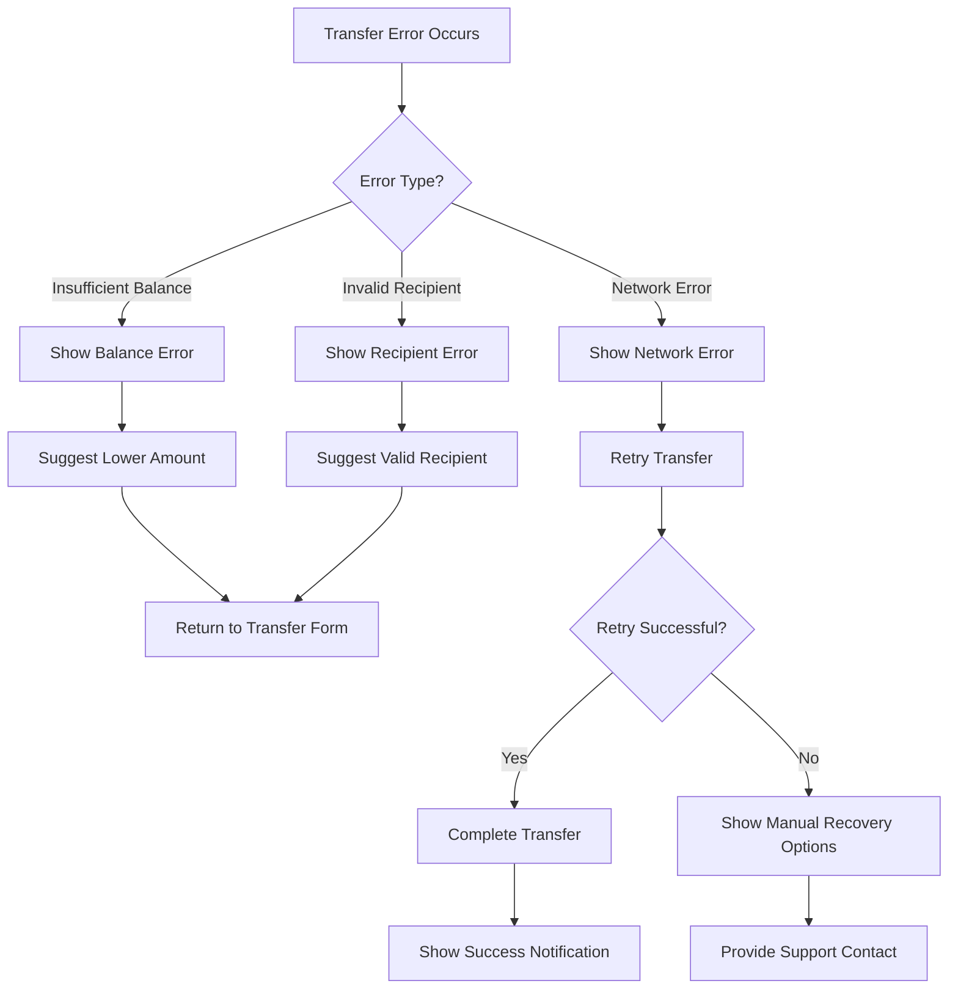
```mermaid
flowchart TD
    A[Transfer Error Occurs] --> B{Error Type?}
    B -->|Insufficient Balance| C[Show Balance Error]
    B -->|Invalid Recipient| D[Show Recipient Error]
    B -->|Network Error| E[Show Network Error]
    C --> F[Suggest Lower Amount]
    D --> G[Suggest Valid Recipient]
    E --> H[Retry Transfer]
    F --> I[Return to Transfer Form]
    G --> I
    H --> J{Retry Successful?}
    J -->|Yes| K[Complete Transfer]
    J -->|No| L[Show Manual Recovery Options]
    K --> M[Show Success Notification]
    L --> N[Provide Support Contact]
```

### 6.2 Swap Error Recovery

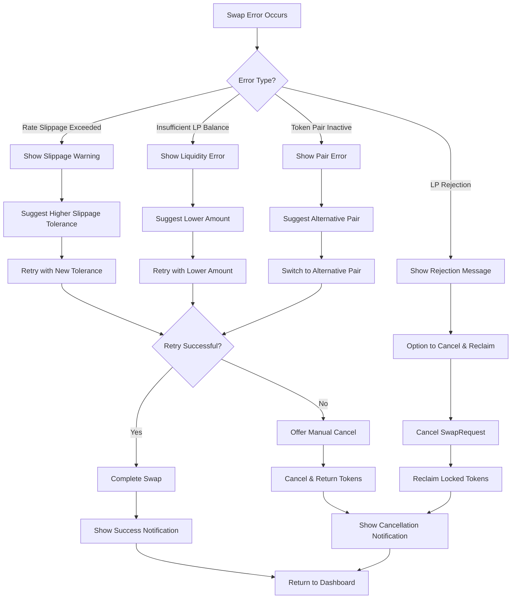
```mermaid
flowchart TD
    A[Swap Error Occurs] --> B{Error Type?}
    B -->|Rate Slippage Exceeded| C[Show Slippage Warning]
    B -->|Insufficient LP Balance| D[Show Liquidity Error]
    B -->|Token Pair Inactive| E[Show Pair Error]
    B -->|LP Rejection| F[Show Rejection Message]
    C --> G[Suggest Higher Slippage Tolerance]
    D --> H[Suggest Lower Amount]
    E --> I[Suggest Alternative Pair]
    F --> J[Option to Cancel & Reclaim]
    G --> K[Retry with New Tolerance]
    H --> L[Retry with Lower Amount]
    I --> M[Switch to Alternative Pair]
    J --> N[Cancel SwapRequest]
    K --> O{Retry Successful?}
    L --> O
    M --> O
    N --> P[Reclaim Locked Tokens]
    O -->|Yes| Q[Complete Swap]
    O -->|No| R[Offer Manual Cancel]
    Q --> S[Show Success Notification]
    R --> T[Cancel & Return Tokens]
    P --> U[Show Cancellation Notification]
    S --> V[Return to Dashboard]
    T --> U
    U --> V
```

## 7. System Integration Flows

### 7.1 Party Validation Integration

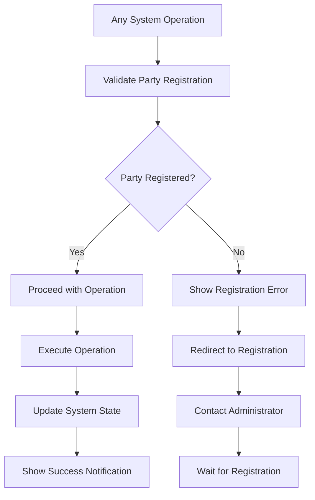
```mermaid
flowchart TD
    A[Any System Operation] --> B[Validate Party Registration]
    B --> C{Party Registered?}
    C -->|Yes| D[Proceed with Operation]
    C -->|No| E[Show Registration Error]
    D --> F[Execute Operation]
    E --> G[Redirect to Registration]
    F --> H[Update System State]
    G --> I[Contact Administrator]
    H --> J[Show Success Notification]
    I --> K[Wait for Registration]
```

### 7.2 Token Listing Validation

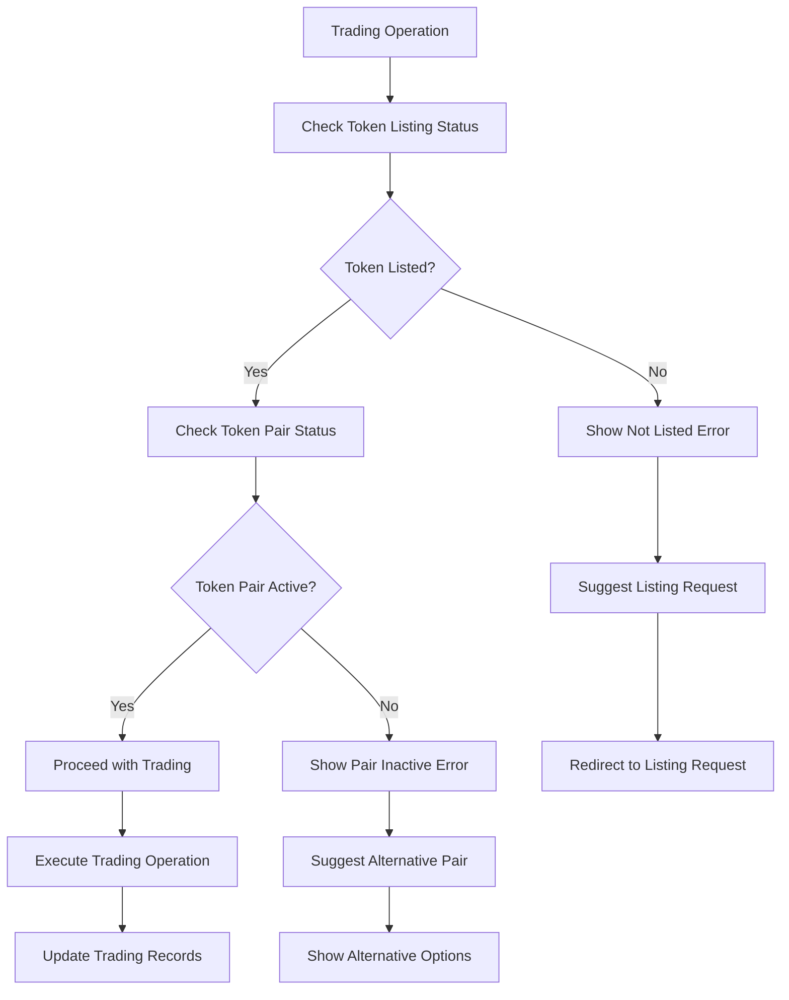
```mermaid
flowchart TD
    A[Trading Operation] --> B[Check Token Listing Status]
    B --> C{Token Listed?}
    C -->|Yes| D[Check Token Pair Status]
    C -->|No| E[Show Not Listed Error]
    D --> F{Token Pair Active?}
    F -->|Yes| G[Proceed with Trading]
    F -->|No| H[Show Pair Inactive Error]
    G --> I[Execute Trading Operation]
    E --> J[Suggest Listing Request]
    H --> K[Suggest Alternative Pair]
    I --> L[Update Trading Records]
    J --> M[Redirect to Listing Request]
    K --> N[Show Alternative Options]
```

## 8. Dashboard Navigation Flows

### 8.1 Role-Based Dashboard Access

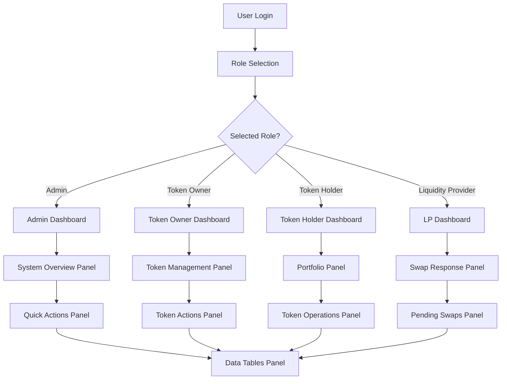
```mermaid
flowchart TD
    A[User Login] --> B[Role Selection]
    B --> C{Selected Role?}
    C -->|Admin| D[Admin Dashboard]
    C -->|Token Owner| E[Token Owner Dashboard]
    C -->|Token Holder| F[Token Holder Dashboard]
    C -->|Liquidity Provider| G[LP Dashboard]
    D --> H[System Overview Panel]
    E --> I[Token Management Panel]
    F --> J[Portfolio Panel]
    G --> K[Swap Response Panel]
    H --> L[Quick Actions Panel]
    I --> M[Token Actions Panel]
    J --> N[Token Operations Panel]
    K --> O[Pending Swaps Panel]
    L --> P[Data Tables Panel]
    M --> P
    N --> P
    O --> P
```

### 8.2 Cross-Dashboard Navigation

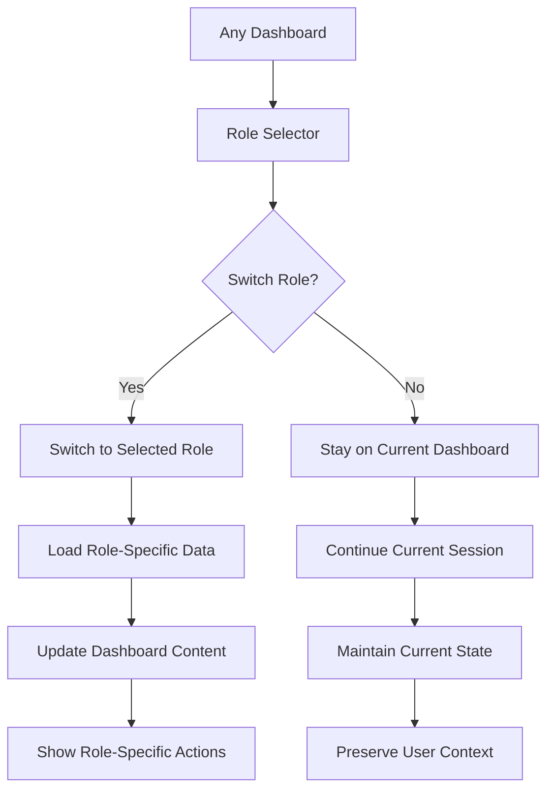
```mermaid
flowchart TD
    A[Any Dashboard] --> B[Role Selector]
    B --> C{Switch Role?}
    C -->|Yes| D[Switch to Selected Role]
    C -->|No| E[Stay on Current Dashboard]
    D --> F[Load Role-Specific Data]
    E --> G[Continue Current Session]
    F --> H[Update Dashboard Content]
    G --> I[Maintain Current State]
    H --> J[Show Role-Specific Actions]
    I --> K[Preserve User Context]
```

## 9. Notification and Feedback Flows

### 9.1 Success Notification Flow

```mermaid
flowchart TD
    A[Operation Completed] --> B[Show Success Notification]
    B --> C[Display Success Message]
    C --> D[Show Operation Details]
    D --> E[Auto-hide after 3 seconds]
    E --> F[Update Dashboard Data]
    F --> G[Refresh Related Panels]
    G --> H[Log Success Event]
```

### 9.2 Error Notification Flow

```mermaid
flowchart TD
    A[Operation Failed] --> B[Show Error Notification]
    B --> C[Display Error Message]
    C --> D[Show Error Details]
    D --> E[Provide Recovery Options]
    E --> F[Auto-hide after 5 seconds]
    F --> G[Log Error Event]
    G --> H[Update Error Count]
```

## 10. Data Flow Integration

### 10.1 Real-time Data Updates

```mermaid
flowchart TD
    A[System Event Occurs] --> B[Update Contract State]
    B --> C[Trigger UI Update]
    C --> D[Refresh Dashboard Panels]
    D --> E[Update Statistics]
    E --> F[Update Data Tables]
    F --> G[Update Notifications]
    G --> H[Log System Event]
```

### 10.2 Data Validation Flow

```mermaid
flowchart TD
    A[User Input] --> B[Client-side Validation]
    B --> C{Validation Passed?}
    C -->|Yes| D[Server-side Validation]
    C -->|No| E[Show Client Error]
    D --> F{Validation Passed?}
    F -->|Yes| G[Process Operation]
    F -->|No| H[Show Server Error]
    G --> I[Update System State]
    H --> J[Provide Error Details]
    I --> K[Show Success Notification]
    J --> L[Suggest Corrections]
```

## Updated Swap Design Features

### 1. Simplified Swap Architecture

- **Removed LiquidityResponse Template**: Direct interaction through SwapRequest only
- **Streamlined Choices**: `AcceptSwap`, `FinalizeSwap`, `CancelSwapRequest`, `RejectSwapRequest`
- **Single Contract Management**: All swap logic contained within SwapRequest template

### 2. Enhanced Slippage Protection

- **Configurable Slippage Tolerance**: Swappers set their acceptable slippage percentage
- **Real-time Rate Validation**: LPs validate current rates against expected amounts
- **Automatic Slippage Checks**: System prevents swaps exceeding tolerance limits

### 3. Improved Calculation Logic

- **Dynamic Output Calculation**: `calculateExpectedOutputAmount` based on token direction
- **Rate Direction Awareness**: Different calculations for input vs quote tokens
- **Range Validation**: Ensures slippage tolerance within acceptable bounds (0-100%)

### 4. Two-Phase Swap Execution

- **Phase 1 - LP Accept**: LP locks output tokens and receives input tokens immediately
- **Phase 2 - Swapper Finalize**: Swapper completes swap by accepting output tokens
- **Atomic Completion**: Both phases must complete for successful swap

### 5. Enhanced Error Handling

- **Slippage Rejection**: Automatic rejection when market moves beyond tolerance
- **Reverse Lock Creation**: LP rejection creates recovery path for swapper
- **Balance Validation**: LP balance checked before accepting swaps
- **Rate Drift Protection**: Current rates validated at time of acceptance

## Key Design Principles

### 1. User-Centric Design

- Role-based dashboards provide relevant information and actions
- Intuitive navigation between different system areas
- Clear feedback for all user actions
- Real-time slippage and rate information

### 2. Security-First Approach

- All operations validate party registration
- Two-step approval processes for critical operations
- Lock-based token transfers prevent unauthorized access
- Slippage protection prevents unfavorable swaps

### 3. Atomic Operations

- Swaps execute completely or fail entirely
- Token transfers are atomic with explicit acceptance
- System maintains consistency across all operations
- Two-phase swap completion ensures both parties benefit

### 4. Real-time Updates

- Dashboard panels update automatically
- Notifications provide immediate feedback
- Data tables reflect current system state
- Live rate validation and slippage monitoring

### 5. Error Recovery

- Comprehensive error handling and recovery flows
- User-friendly error messages with actionable suggestions
- Graceful degradation when operations fail
- Multiple recovery paths for different error scenarios

### 6. Market-Responsive Design

- Dynamic rate calculations based on current market conditions
- Configurable slippage tolerance for market volatility
- Real-time validation prevents stale rate execution
- Flexible rate direction handling for different token pairs

This comprehensive user flow chart provides a complete view of how users interact with the updated DAML Token Exchange System, featuring the new simplified swap architecture with enhanced slippage protection and improved error recovery mechanisms.
