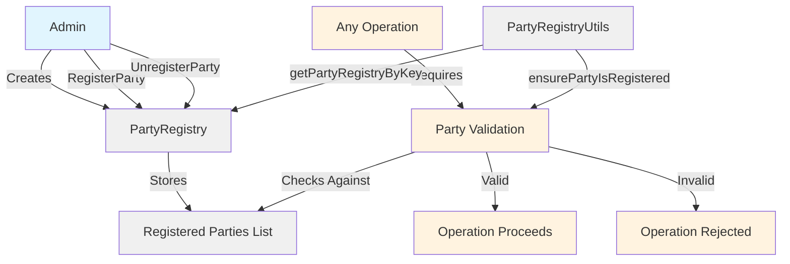
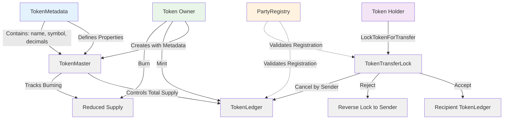
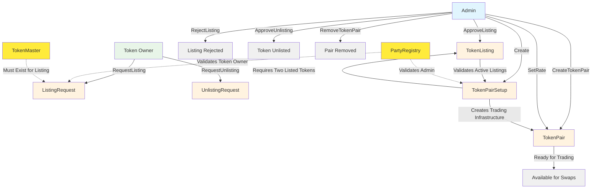
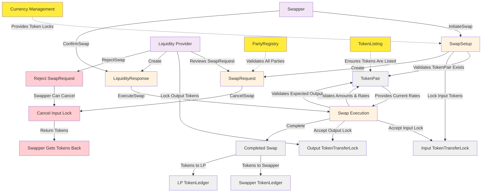

# DAML Token Exchange System Workflow

## Overview

This document describes the comprehensive workflow of the DAML Token Exchange System. The system is organized into four key workflow areas: Party Registration, Currency Management, Exchange TokenPair Setup, and Exchange Swap Execution. Each workflow builds upon the previous ones to create a complete decentralized token exchange platform.

## System Architecture

### 1. Registry System (Party Management)

#### Core Components

- **PartyRegistry**: Central authority template for managing party registration
- **PartyRegistryUtils**: Utility functions for validation and lookup

#### Workflows

##### Party Registration

1. **Admin** creates a `PartyRegistry` contract
2. **Admin** can register new parties using `RegisterParty` choice
3. **Admin** can unregister parties using `UnregisterParty` choice
4. All registered parties are stored in the registry for validation

##### Party Validation

- All system operations validate party registration through `ensurePartyIsRegistered`
- Only registered parties can participate in token operations and exchange activities

##### Diagram

### 2. Currency System (Token Management)

#### Core Components

- **TokenMetadata**: Contains token information (name, symbol, decimals, etc.)
- **TokenMaster**: Controls token supply and minting/burning operations
- **TokenLedger**: Tracks individual party token holdings
- **TokenTransferLock**: Implements secure transfer mechanism

#### Workflows

##### Token Creation and Minting

1. **Token Owner** creates a `TokenMaster` contract with metadata
2. **Token Owner** can mint new tokens using `Mint` choice
3. Minting creates or updates the owner's `TokenLedger` with new balance
4. Total supply is tracked in the `TokenMaster` contract

##### Token Transfer Process

1. **Token Holder** initiates transfer by calling `LockTokenForTransfer` on their `TokenLedger`
2. System creates a `TokenTransferLock` contract for the recipient
3. **Recipient** has two options:
   - `Accept`: Tokens move to the recipient's ledger
   - `Reject`: Creates a reverse lock back to the sender
4. **Sender** has one option if the recipient doesn't respond:
   - `Cancel`: Sender cancels the `TokenTransferLock` to reclaim their tokens

##### Token Burning

1. **Token Owner** can burn tokens using `Burn` choice on `TokenMaster`
2. Specified `TokenLedger` contract is consumed
3. Total supply is reduced accordingly
4. Remaining balance (if any) creates new `TokenLedger`

##### Diagram

### 3. Exchange TokenPair Setup System

#### Core Components

- **TokenListing**: Manages which tokens are available for trading
- **TokenListingUtils**: Utility functions for listing validation
- **TokenPairSetup**: Template for configuring trading pairs
- **TokenPair**: Defines active trading pairs with exchange rates
- **TokenPairData**: Data structure containing pair information

#### Workflow

##### Token Listing Process

1. **Token Owner** creates `ListingRequest` for their token
2. **Admin** reviews the request and either:
   - `ApproveListing`: Creates an active `TokenListing` contract
   - `RejectListing`: Archives the request
3. **Token Owner** can later request unlisting through `UnlistingRequest`
4. **Admin** can approve unlisting to remove the token from exchange

##### Trading Pair Creation

1. **Admin** creates `TokenPairSetup` specifying two listed tokens
2. System validates both tokens have active `TokenListing` contracts
3. **Admin** calls `CreateTokenPair` with initial buying and selling prices
4. Active `TokenPair` contract is created, ready for trading
5. **Admin** can update exchange rates using `SetRate` or remove the pair entirely

##### Diagram

### 4. Exchange Swap Execution System

#### Core Components

- **SwapSetup**: Helper template for initiating token swaps
- **SwapRequest**: Manages swap initiation and execution logic
- **LiquidityResponse**: Handles liquidity provider participation
- **TokenTransferLock**: Secures tokens during swap process

#### Workflow

##### Swap Initiation

1. **Swapper** creates `SwapSetup` with desired swap parameters
2. **Swapper** calls `InitiateSwap` which:
   - Validates the TokenPair exists and is active
   - Locks input tokens via `TokenTransferLock`
   - Creates `SwapRequest` with swap details and expected output

##### Liquidity Provider Response

3. **Liquidity Provider** reviews the `SwapRequest`
4. **Liquidity Provider** locks output tokens for the swapper
5. **Liquidity Provider** creates `LiquidityResponse` indicating readiness

##### Swap Execution

6. **Swapper** calls `ConfirmSwap` on the `LiquidityResponse`
7. System validates amounts against current exchange rates
8. Both token locks are accepted simultaneously
9. Tokens are distributed to both parties, completing the swap

##### Cancellation and Rejection Flows

- **Swapper** can `CancelSwap` to retrieve their locked tokens
- **Liquidity Provider** can `RejectSwap` to decline participation
- All cancellations return tokens to their original holders safely

##### Diagram

## Key Design Patterns

### 1. Permission-based Access Control

- All operations validate party registration through `PartyRegistryUtils`
- Only registered parties can participate in system activities
- Multi-level authorization structure (admin, token owner, liquidity provider, general users)

### 2. Lock-based Secure Transfers

- Tokens are locked rather than immediately transferred
- Recipients must explicitly accept transfers
- Provides safety against unwanted or erroneous transfers

### 3. Two-step Approval Processes

- Token listing requires owner request followed by admin approval
- Token swaps require swapper initiation followed by liquidity provider response
- Ensures explicit consent from all participating parties

### 4. Active Validation Dependencies

- Token pairs continuously validate that underlying tokens remain actively listed
- Swap requests validate current token pair rates and availability
- Prevents operations on delisted, invalid, or stale token pairs

### 5. Atomic Operations

- Swaps execute both sides simultaneously or fail completely
- Token transfers are atomic (lock → accept → ledger update)
- Maintains system consistency and prevents partial states

## Security Considerations

1. **Registry Validation**: All operations check party registration status
2. **Multi-party Signatures**: Critical operations require multiple party authorization
3. **Lock Mechanism**: Prevents accidental or malicious token transfers
4. **Rate Validation**: Swap amounts are validated against current exchange rates
5. **Active Listing Checks**: Ensures only valid tokens participate in trading

## Complete System Usage Flow

1. **System Setup**: Admin creates party registry and registers all participants
2. **Token Creation**: Token owners create `TokenMaster` contracts and mint initial supply
3. **Exchange Listing**: Token owners request listing; admin reviews and approves active tokens
4. **Trading Infrastructure**: Admin creates trading pairs with initial exchange rates
5. **Token Trading**: Users initiate swaps, liquidity providers respond, trades execute atomically
6. **Ongoing Management**: Rate updates, token supply management, and system maintenance
