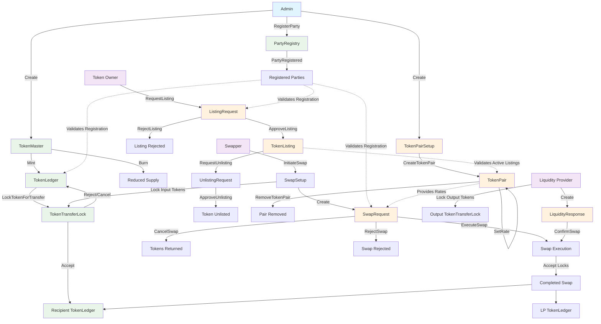

# DAML Token Exchange System Workflow

## Overview

This document describes the comprehensive workflow of the DAML Token Exchange System, which consists of three main modules: Registry (Party Management), Currency (Token Management), and Exchange (Trading Operations).

## System Architecture Diagram

## 1. Registry System (Party Management)

### Core Components

- **PartyRegistry**: Central authority template for managing party registration
- **PartyRegistryUtils**: Utility functions for validation and lookup

### Workflows

#### Party Registration

1. **Admin** creates a `PartyRegistry` contract
2. **Admin** can register new parties using `RegisterParty` choice
3. **Admin** can unregister parties using `UnregisterParty` choice
4. All registered parties are stored in the registry for validation

#### Party Validation

- All system operations validate party registration through `ensurePartyIsRegistered`
- Only registered parties can participate in token operations and exchange activities

## 2. Currency System (Token Management)

### Core Components

- **TokenMetadata**: Contains token information (name, symbol, decimals, etc.)
- **TokenMaster**: Controls token supply and minting/burning operations
- **TokenLedger**: Tracks individual party token holdings
- **TokenTransferLock**: Implements secure transfer mechanism

### Workflows

#### Token Creation and Minting

1. **Token Owner** creates a `TokenMaster` contract with metadata
2. **Token Owner** can mint new tokens using `Mint` choice
3. Minting creates or updates the owner's `TokenLedger` with new balance
4. Total supply is tracked in the `TokenMaster` contract

#### Token Transfer Process

1. **Holder** initiates transfer by calling `LockTokenForTransfer` on their `TokenLedger`
2. System creates a `TokenTransferLock` contract for the recipient
3. **Recipient** has two options:
   - `Accept`: Tokens move to recipient's ledger
   - `Reject`: Creates reverse lock back to sender
4. **Sender**:
   - `Cancel`: Sender cancel the `TokenTransferLock` to reclaim tokens

#### Token Burning

1. **Token Owner** can burn tokens using `Burn` choice on `TokenMaster`
2. Specified `TokenLedger` contract is consumed
3. Total supply is reduced accordingly
4. Remaining balance (if any) creates new `TokenLedger`

## 3. Exchange System (Trading Operations)

### Core Components

- **TokenListing**: Manages which tokens are available for trading
- **TokenPair**: Defines trading pairs with exchange rates
- **SwapRequest**: Handles swap initiation and execution
- **LiquidityResponse**: Manages liquidity provider participation

### Workflows

#### Token Listing Process

1. **Token Owner** creates `ListingRequest` for their token
2. **Admin** reviews and either:
   - `ApproveListing`: Creates active `TokenListing`
   - `RejectListing`: Archives the request
3. **Token Owner** can later request unlisting through `UnlistingRequest`
4. **Admin** can approve unlisting to remove token from exchange

#### Trading Pair Setup

1. **Admin** creates `TokenPairSetup` with two listed tokens
2. **Admin** calls `CreateTokenPair` with initial exchange rates
3. `TokenPair` contract is created with buying/selling prices
4. **Admin** can update rates using `SetRate` or remove pair entirely

#### Token Swap Execution

1. **Swapper** creates `SwapSetup` with desired swap parameters
2. **Swapper** calls `InitiateSwap` which:
   - Locks input tokens via `TokenTransferLock`
   - Creates `SwapRequest` with swap details
3. **Liquidity Provider** responds by:
   - Locking output tokens for the swapper
   - Creating `LiquidityResponse`
4. **Swapper** can `ConfirmSwap` to execute the trade
5. Both token locks are accepted simultaneously, completing the swap

#### Swap Cancellation and Rejection

- **Swapper** can `CancelSwap` to retrieve locked tokens
- **Liquidity Provider** can `RejectSwap` to decline participation
- All cancellations/rejections return tokens to original holders

## Key Design Patterns

### 1. Permission-based Access Control

- All operations validate party registration through `PartyRegistryUtils`
- Only registered parties can participate in system activities
- Multi-level authorization (admin, token owner, liquidity provider)

### 2. Lock-based Secure Transfers

- Tokens are locked rather than immediately transferred
- Recipients must explicitly accept transfers
- Provides safety against unwanted or erroneous transfers

### 3. Two-step Approval Processes

- Token listing requires owner request + admin approval
- Token swaps require swapper initiation + LP response
- Ensures all parties consent to operations

### 4. Active Validation Dependencies

- Token pairs validate underlying tokens remain listed
- Swap requests validate token pair rates and availability
- Prevents operations on delisted or invalid tokens

### 5. Atomic Operations

- Swaps execute both sides simultaneously or fail completely
- Token transfers are atomic (lock → accept → ledger update)
- Maintains system consistency and prevents partial states

## Security Considerations

1. **Registry Validation**: All operations check party registration status
2. **Multi-party Signatures**: Critical operations require multiple party authorization
3. **Lock Mechanism**: Prevents accidental or malicious token transfers
4. **Rate Validation**: Swap amounts are validated against current exchange rates
5. **Active Listing Checks**: Ensures only valid tokens participate in trading

## Usage Flow Summary

1. **Setup**: Admin registers parties and creates party registry
2. **Token Creation**: Token owners create and mint tokens
3. **Exchange Listing**: Token owners request listing, admin approves
4. **Trading Setup**: Admin creates trading pairs with exchange rates
5. **Token Swapping**: Users initiate swaps, LPs provide liquidity, swaps execute
6. **Management**: Ongoing rate updates, token burning, and system maintenance
